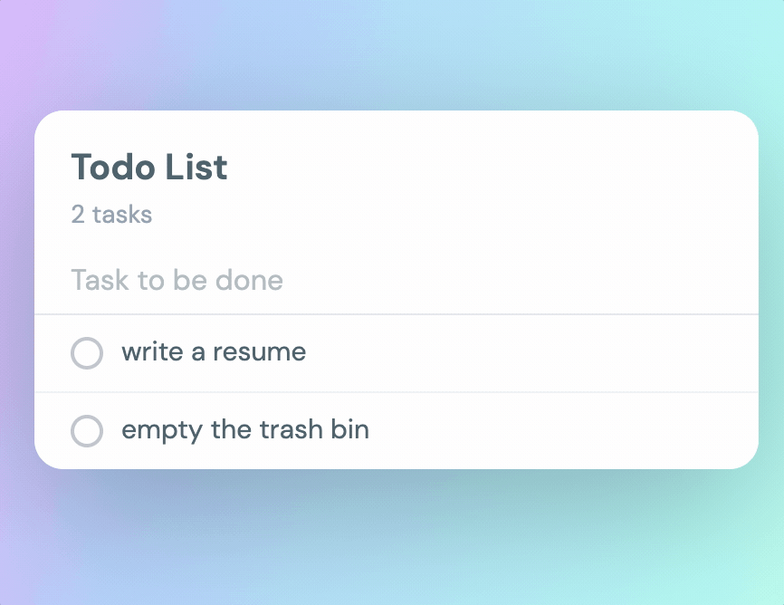

# react-todo-list
Todo list built with React & Express

## Usage
1. Install NPM packages in todo_api
   ```sh
   cd todo_api
   npm install
   ```
2. Run Express in todo_api
   ```sh
   npm run start
   ```

3. Install NPM packages in todo_react
   ```sh
   cd todo_react
   npm install
   ```
   
4. Run React in todo_react
   ```sh
   npm run start
   ```
   
## Screenshot


